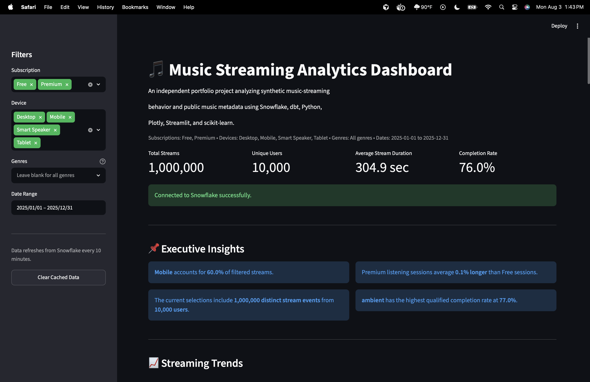
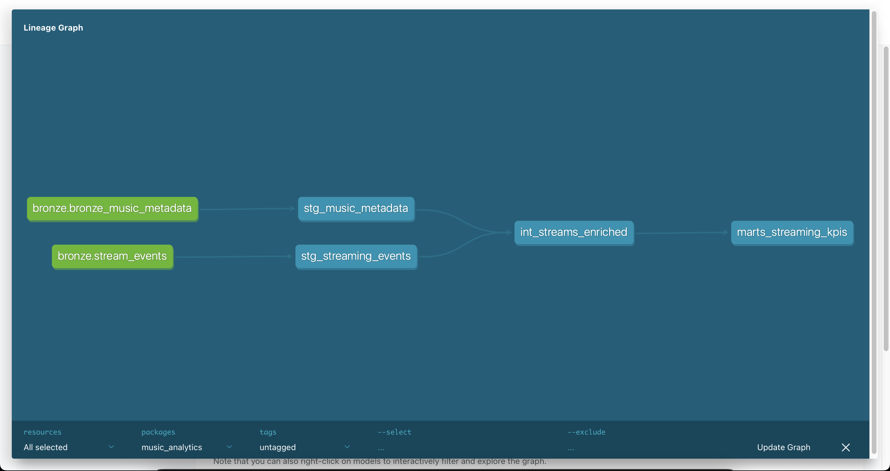
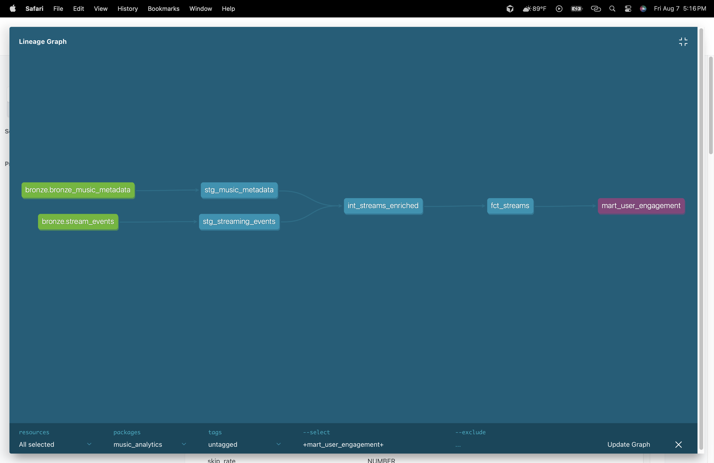

# 🎵 End-to-End Music Streaming Analytics Platform

A production-inspired Analytics Engineering project that ingests, validates, transforms, and analyzes music streaming data using Python, AWS, Snowflake, dbt, Great Expectations, Apache Airflow, Streamlit, and GitHub Actions.


---

# 📖 Project Overview

The Music Streaming Analytics Platform simulates the modern cloud data stack used by companies such as Spotify, Apple Music, and Amazon Music.

The platform ingests user listening events, stores raw data in the cloud, validates data quality, transforms data into analytics-ready models, orchestrates automated workflows, powers executive dashboards, and prepares curated datasets for machine learning.

Rather than demonstrating a single technology, this project showcases how modern analytics platforms are engineered end-to-end using industry-standard tools and best practices.

---

# 📊 Dashboard Showcase

### Executive Dashboard



---

# 🚀 Live Demo

👉 https://music-streaming-analytics.streamlit.app

---

# 🎯 Objectives

- Build a scalable cloud analytics platform
- Model event-driven streaming data
- Implement dimensional data modeling
- Apply Analytics Engineering best practices using dbt
- Automate workflows using orchestration
- Validate data quality throughout the pipeline
- Develop executive dashboards
- Create ML-ready feature datasets
- Demonstrate production-ready engineering principles

---

# 🏗️ Architecture

```text
                  Public Music Metadata
                           +
                 Generated Streaming Events
                           │
                           ▼
                    Python Ingestion
                           │
                           ▼
                      AWS S3 (Bronze)
                           │
                           ▼
                      Snowflake
                           │
                           ▼
                    dbt Transformations
              (Staging → Intermediate → Marts)
                           │
                ┌──────────┴──────────┐
                ▼                     ▼
         Business Marts         Feature Tables
                │                     │
                ▼                     ▼
        Streamlit Dashboard     Jupyter ML
                │
                ▼
         Executive Analytics
```

---

# 🛠️ Technology Stack

| Category | Technology |
|-----------|------------|
| Programming | Python |
| Cloud Storage | AWS S3 |
| Data Warehouse | Snowflake |
| Data Modeling | dbt Core |
| Orchestration | Apache Airflow |
| Data Quality | Great Expectations + dbt Tests |
| Machine Learning | Scikit-Learn |
| Visualization | Streamlit |
| Notebooks | Jupyter |
| Containers | Docker |
| CI/CD | GitHub Actions |
| Version Control | Git & GitHub |

---

# 📂 Project Structure

```text
music-streaming-analytics-platform/

├── configs/
├── dashboard/
├── data/
│   ├── raw/
│   ├── processed/
│   └── sample/
├── dbt_project/
├── docs/
├── ingestion/
├── notebooks/
├── orchestration/
├── scripts/
├── tests/
├── .github/
├── docker-compose.yaml
├── requirements.txt
└── README.md
```

---

# 🧠 Business Domain

This project models a fictional music streaming company inspired by platforms such as:

- Spotify
- Apple Music
- Amazon Music
- YouTube Music

The analytical environment combines:

- Public music metadata
- Synthetic users
- Listening events
- Subscription activity
- Recommendation interactions
- Revenue metrics
- Product analytics

This hybrid approach creates realistic analytical scenarios while avoiding proprietary datasets.

---

# 📊 Business Questions

The platform answers questions such as:

- How many Daily Active Users (DAU) do we have?
- Which artists are trending?
- Which songs have the highest completion rate?
- What is Premium conversion?
- Which recommendations drive engagement?
- What factors contribute to churn?
- Which devices generate the highest listening time?
- What is customer lifetime value?
- How do listening behaviors vary geographically?

---

# 🧱 Data Architecture

The warehouse follows the Medallion Architecture.

### Bronze

Raw immutable source data.

### Silver

Cleaned, standardized, validated datasets.

### Gold

Business-ready dimensional models and analytics marts.

### Feature Layer

Machine learning feature tables.

---

# 📈 Analytics Engineering

The warehouse follows Kimball dimensional modeling principles.

### Dimension Tables

- Users
- Artists
- Albums
- Tracks
- Devices
- Subscriptions
- Date

### Fact Tables

- Listening Events
- Search Events
- Playlist Events
- Recommendation Events
- Payment Events

Business marts expose curated datasets for reporting, dashboards, and downstream analytics.

---

# 🤖 Machine Learning

Included notebooks demonstrate:

- Exploratory Data Analysis
- Customer Segmentation
- Churn Prediction
- Recommendation Features
- Revenue Forecasting

Models consume curated analytical tables instead of raw transactional data, reflecting production analytics workflows.

---

# ✅ Data Quality

Data quality is enforced through:

- dbt Tests
- Great Expectations
- Schema validation
- Referential integrity checks
- Null validation
- Duplicate detection

---

# ⚙️ CI/CD

GitHub Actions automatically:

- Install project dependencies
- Run Python validation
- Execute dbt tests
- Validate data quality
- Lint Python code
- Verify project builds successfully

---

# 📚 Documentation

Project documentation includes:

- Business Requirements
- Domain Model
- Warehouse Architecture
- Star Schema
- Data Dictionary
- Architecture Diagrams
- Deployment Guide

---

# 🚀 Future Enhancements

Potential future improvements include:

- Kafka event streaming
- Near real-time dashboards
- Feature Store integration
- ML model deployment
- A/B testing framework
- Recommendation engine
- Data observability platform

---
# 📈 dbt Project Lineage

Complete end-to-end lineage from Bronze ingestion through staging, intermediate transformations, and analytical models.



---

# 🏗️ Business Mart Lineage

Example lineage showing how raw streaming events are transformed into business-ready analytical marts through the star schema.



# 👨‍💻 Author

Built by **Sam Sahami** as a production-inspired portfolio project demonstrating modern Analytics Engineering, Data Engineering, Business Intelligence, and Applied Machine Learning using today's cloud-native data stack.